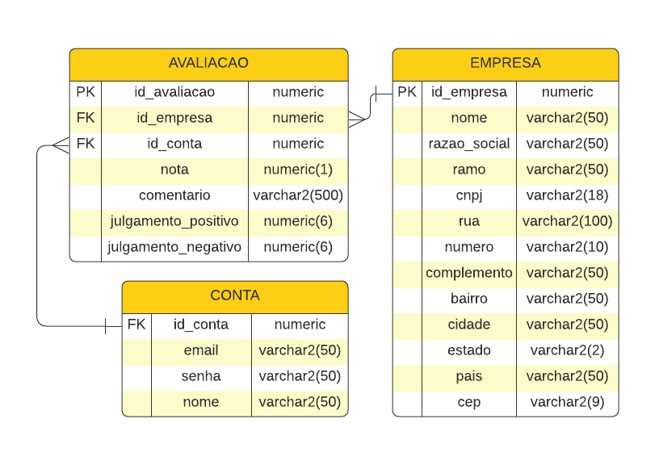

# TechBridge

Uma API para o sistema de avaliação de empresas e negócios sendo desenvolvida para avaliação da disciplina Digital Business Enablement.

## Modelo do banco de dados

<div align="center">
    
</div>

## Endpoints ~DESATUALIZADO~

- Conta
    - [Sign up](#sign-up)
    - ~~[Log in](#log-in)~~
    - [Excluir](#excluir-conta)
    - [Detalhes](#detalhes-da-conta)
    - [Listar](#listar-contas)
    - [Editar](#editar-conta)
- Empresa
    - [Cadastrar](#cadastrar-empresa)
    - [Detalhes](#detalhes-da-empresa)
    - [Listar](#listar-empresas)
    - [Excluir](#excluir-empresa)
    - [Editar](#editar-empresa)
- Avaliação
    - [Criar](#criar-avaliacao)
    - [Excluir](#excluir-avaliacao)
    - [Editar](#editar-avaliacao)
    - [Detalhes](#detalhes-de-avaliacao)
    - ~~[Julgar](#julgar-avaliacao)~~

### Sign up
---

`POST` /techbridge/api/conta

*Campos de requisição*

| campo | tipo  | obrigatório | descrição                                      |
|-------|-------|:-----------:|------------------------------------------------|
| email | texto |     sim     | email da conta                                 |
| senha | texto |     sim     | senha da conta (mínimo 8 caracteres)           |
| nome  | texto |     sim     | nome do usuário                                |
| id    | longo |     ---     | Gerado automaticamente quando a conta é criada |


*Exemplo de requisição*
```json
{
  "email": "exemplo@exemplo.com",
  "senha": "123456789",
  "nome": "Fulano"
}
```

*Resposta*
| código | descrição | exemplo de resposta
|-|-|-|
|201| Usuário cadastrado com sucesso|
|400| Dados inválidos| `{"mensagem": "dados inválidos"}`

### Log in
---
`POST` /techbridge/api/conta/login

*Campos de requisição*

| campo | tipo  | obrigatório | descrição      |
|-------|-------|:-----------:|----------------|
| email | texto |     sim     | email da conta |
| senha | texto |     sim     | senha da conta |

*Exemplo de requisição*
```json
{
    "email": "exemplo@exemplo.com",
    "senha": 123456789
}
```

*Resposta*

| código | descrição                              | exemplo de resposta                    |
|--------|----------------------------------------|----------------------------------------|
| 200    | Dados de login encontrados e validados |                                        |
| 400    | Dados inválidos                        | `{"mensagem": "dados inválidos"}`      |
| 401    | Conta não encontrada                   | `{"mensagem": "conta não encontrada"}` |

### Excluir conta
---
`DELETE` /techbridge/api/conta/{contaId}

*Campos de requisição*

| campo   | tipo  | obrigatório | descrição                         |
|---------|-------|:-----------:|-----------------------------------|
| senha   | texto |     sim     | senha da conta                    |
| contaId | longo |     sim     | ID da conta a ser apagada no path |

*Exemplo de requisição*
```
/techbridge/api/conta/1
```

*Resposta*

| código | descrição     |
|--------|---------------|
| 204    | conta apagada |

### Detalhes da conta
---

`GET` /techbridge/api/conta/{contaId}

*Campos de requisição*

| campo   | tipo  | obrigatório | descrição   |
|---------|-------|:-----------:|-------------|
| contaId | longo |     sim     | id da conta |

*Exemplo de requisição*
```
    /techbridge/api/conta/1
```
*Exemplo de resposta*
```json
{
    "email": "exemplo@exemplo.com",
    "nome": "Fulano",
    "contaId": 1
}
```

*Resposta*

| código | descrição                                |
|--------|------------------------------------------|
| 200    | Os dados foram retornados                |
| 404    | Nao foi encontrada uma conta com esse ID |

### Listar contas
---
Lista todas as contas cadastradas

`GET` /techbridge/api/conta

*Exemplo de resposta*
```json
[
  {
      "email": "exemplo@exemplo.com",
      "senha": "123456789",
      "nome": "Fulano",
      "id": 1
  },
  {
      "email": "outlook@outlook.com",
      "senha": "987654321",
      "nome": "Ciclano",
      "id": 2
  }
]
```

### Editar conta

`PUT`/techbridge/api/conta/{id}

*Campos de requisição*

| campo | tipo  | obrigatório | descrição                                   |
|-------|-------|:-----------:|---------------------------------------------|
| email | texto |     sim     | email da conta                              |
| senha | texto |     sim     | senha da conta                              |
| nome  | texto |     sim     | nome do usuário                             |
| id    | longo |     ---     | ID da conta a ser editada. Atributo do path |

*Exemplo de requisição*

```json
{
  "email": "exemplo@exemplo.com",
  "senha": "123456789",
  "nome": "Fulano"
}
```
*Resposta*

| código | descrição                 | exemplo de resposta                    |
|--------|---------------------------|----------------------------------------|
| 200    | Conta editada com sucesso |                                        |
| 404    | Conta não encontrada      | `{"mensagem": "Conta não encontrada"}` |

### Cadastrar empresa
---
`POST` /techbridge/api/empresa

*Campos de requisição*

| campo       | tipo  | obrigatório | descrição                  |
|-------------|-------|:-----------:|----------------------------|
| razaoSocial | texto |     sim     | nome social da empresa     |
| nome        | texto |     nao     | nome oficial da empresa    |
| ramo        | texto |     sim     | ramo de atuação da empresa |
| CNPJ        | texto |     nao     | CNPJ da empresa            |
| endereco    | texto |     nao     | endereco da empresa        |

O campo `empresaId` será gerado automaticamente.

*Exemplo de requisição*
```json
{
  "razaoSocial": "The Code of Duty",
  "ramo": "Consultoria de TI",
  "endereco": "Rua Advanced Warfare, 1, São Paulo-SP, 12345-123"
}
```

*Exemplo de requisição completa*
```json
{
  "razaoSocial": "The Code of Duty",
  "ramo": "Consultoria de TI",
  "nome": "Techbridge LTDA",
  "CNPJ": "12.345.678/0001-00",
  "endereco": "Rua Advanced Warfare, 1, São Paulo-SP, 12345-123"
}
```

*Resposta*

| código | descrição                                | exemplo de resposta                    |
|--------|------------------------------------------|----------------------------------------|
| 201    | Empresa cadastrada com sucesso           | JSON da empresa com os dados alterados |
| 400    | Empresa já cadastrada ou dados inválidos | `{"mensagem": "dados inválidos"}`      |

### Detalhes da empresa
---

`GET` /techbridge/api/empresa/{id}

*Campos de requisição*

| campo     | tipo  | obrigatório | descrição     |
|-----------|-------|:-----------:|---------------|
| empresaId | longo |     sim     | id da empresa |

*Exemplo de resposta*
```json
{
  "razaoSocial": "The Code of Duty",
  "ramo": "Consultoria de TI",
  "endereco": "Rua Advanced Warfare, 1, São Paulo-SP, 12345-123",
  "empresaId": 2
}
```

Caso o nome ou CNPJ da empresa estejam disponíveis, o servidor também os retornará na resposta. Porém, a requisição pode ser feita sem eles, pois não são campos obrigatórios.

*Resposta*
| código | descrição | exemplo de resposta
|-|-|-
|200| os dados foram retornados | retorno padrão
|404| nao foi encontrada uma empresa com esse ID | `{"mensagem": "empresa não encontrada"}`

### Listar empresas

`GET` /techbridge/api/empresa

*Exemplo de resposta*
```json
[
  {
    "id": 1,
    "razaoSocial": "The Code of Duty",
    "nome": "Techbridge LTDA",
    "ramo": "Consultoria de TI",
    "CNPJ": "12.345.678/0001-00",
    "endereco": "Rua Advanced Warfare, 1, São Paulo-SP, 12345-123"
  },
  {
    "id": 2,
    "razaoSocial": "FIAP",
    "nome": null,
    "ramo": "Consultoria de TI",
    "CNPJ": null,
    "endereco": null
  }
]
```

### Excluir empresa

`DELETE` /techbridge/api/empresa/{id}

*Exemplo de requisição*
```
  /techbridge/api/empresa/1
```

*Resposta*
| código | descrição | exemplo de resposta
|-|-|-
|204| empresa apagada |
|404|empresa nao encontrada|`{"mensagem": "empresa não encontrada"}`


### Editar empresa

`PUT` /techbridge/api/empresa/{id}

*Campos de requisição*

| campo       | tipo  | obrigatório | descrição                  |
|-------------|-------|:-----------:|----------------------------|
| razaoSocial | texto |     sim     | nome social da empresa     |
| nome        | texto |     nao     | nome oficial da empresa    |
| ramo        | texto |     sim     | ramo de atuação da empresa |
| CNPJ        | texto |     nao     | CNPJ da empresa            |
| endereco    | texto |     nao     | endereco da empresa        |

*Exemplo de requisição*
```json
{
  "id": 2,
  "razaoSocial": "FIAP",
  "nome": null,
  "ramo": "Consultoria de TI",
  "CNPJ": null,
  "endereco": null
}
```

*Exemplo de requisição completa*
```json
{
  "razaoSocial": "The Code of Duty",
  "ramo": "Consultoria de TI",
  "nome": "Techbridge LTDA",
  "CNPJ": "12.345.678/0001-00",
  "endereco": "Rua Advanced Warfare, 1, São Paulo-SP, 12345-123"
}
```

*Resposta*

| código | descrição              | exemplo de resposta                      |
|--------|------------------------|------------------------------------------|
| 200    | Empresa editada        | JSON da empresa com os dados alterados   |
| 404    | Empresa não encontrada | `{"mensagem": "empresa não encontrada"}` |

### Criar avaliacao

`POST` /techbridge/api/avaliacao

*Campos de requisição*

| campo      | tipo    | obrigatório | descrição                                                                 |
|------------|---------|:-----------:|---------------------------------------------------------------------------|
| contaId    | longo   |     sim     | ID da conta que está avaliando                                            |
| nota       | inteiro |     sim     | nota da avaliação (entre 1 e 5)                                           |
| comentario | texto   |     nao     | justificativa para a nota dada pelo usuário                               |
| empresaId  | longo   |     sim     | ID da empresa avaliada                                                    |
| julgamento | inteiro |     sim     | Status atual da avaliação julgada por outros usuários. Valor inicial é 0. |

O campo `avaliacaoId` é do tipo longo e obrigatório. Ele é gerado automaticamente.

*Exemplo de requisição*
```json
{
  "contaId": 1,
  "nota": 4,
  "comentario": "Lorem ipsum dolor sit amet, consectetur adipisicing elit",
  "empresaId": 2,
  "julgamento": 0
}
```

*Resposta*

| código | descrição                                                | exemplo de resposta               |
|--------|----------------------------------------------------------|-----------------------------------|
| 201    | Avaliação criada com sucesso.                            |                                   |
| 400    | Campos obrigatórios não preenchidos ou valores inválidos | `{"mensagem": "dados inválidos"}` |
| 401    | Usuário já avaliou essa empresa                          |                                   |

### Excluir avaliacao
---
`DELETE` /techbridge/api/avaliacao/{avaliacaoId}

*Campos de requisição*

| campo   | tipo  | obrigatório | descrição   |
|---------|-------|:-----------:|-------------|
| contaId | longo |     sim     | id da conta |

*Exemplo de requisição*
```json
{
    "contaId": 1
}
```

*Resposta*
| código | descrição 
|-|-
|204| avaliação apagada
|401| Usuário não é o autor da avaliação e não tem permissão para apagá-la

### Editar avaliacao

`PUT` /techbridge/api/avaliacao/{avaliacaoId}

*Campos de requisição*

| campo       | tipo    | obrigatório | descrição                                                                                        |
|-------------|---------|:-----------:|--------------------------------------------------------------------------------------------------|
| avaliacaoId | longo   |     sim     | ID da avaliação que será editada                                                                 |
| contaId     | longo   |     sim     | ID da conta dona da avaliação                                                                    |
| nota        | inteiro |     sim     | nota da avaliação (entre 1 e 5)                                                                  |
| comentario  | texto   |     nao     | justificativa para a nota dada pelo usuário                                                      |
| empresaId   | longo   |     sim     | ID da empresa avaliada                                                                           |
| julgamento  | inteiro |     sim     | Status atual da avaliação julgada por outros usuários. Ele é mantido o mesmo de antes da edição. |

*Exemplo de requisição*
```json
{
  "contaId": 1,
  "nota": 5,
  "comentario": "Lorem ipsum dolor sit amet, consectetur adipisicing elit",
  "empresaId": 2
}
```

*Resposta*

| código | descrição               | exemplo de resposta               |
|--------|-------------------------|-----------------------------------|
| 200    | Avaliação editada       |                                   |
| 401    | usuário não autorizado  |                                   |
| 400    | nenhum campo preenchido | `{"mensagem": "dados inválidos"}` |

### Detalhes de avaliacao

`GET` /techbridge/api/avaliacao/{id}

*Exemplo de requisição*
```
  /techbridge/api/avaliacao/1
```

*Exemplo de resposta*
```json
{
  "id": 1,
  "contaId": 1,
  "nota": 4,
  "comentario": "Lorem ipsum dolor sit amet, consectetur adipisicing elit",
  "empresaId": 2,
  "julgamento": 0
}
```

### Julgar avaliacao
---
Aumenta ou diminui o julgamento de uma avaliação

`PUT` /techbridge/api/avaliacao/{avaliacaoId}/{contaId}

*Campos de requisição*

| campo       | tipo    | obrigatório | descrição                                                                                                                                                                                    |
|-------------|---------|:-----------:|----------------------------------------------------------------------------------------------------------------------------------------------------------------------------------------------|
| avaliacaoId | longo   |     sim     | ID da avaliação que está sendo julgada                                                                                                                                                       |
| contaId     | longo   |     sim     | ID da conta que está julgando                                                                                                                                                                |
| aumentar    | boolean |     sim     | Indica se o julgamento deve ser aumentado (`true`) ou diminuído (`false`). Note que o aumento ou diminuição se refere à contagem total de julgamentos da avaliação, e não à avaliação em si. |

*Exemplo de requisição*
```json
{
    "aumentar": true
}
```

*Resposta*

| código | descrição                                      | exemplo de mensagem de reposta                     |
|--------|------------------------------------------------|----------------------------------------------------|
| 200    | Julgamento aumentado ou diminuido com sucesso. | `{"mensagem": "Julgamento aumentado com sucesso"}` |

## Autores

Feito por [@juniorcavicchioli](https://github.com/juniorcavicchioli?tab=repositories) e [@LucasSGonzalez](https://github.com/LucasSGonzalez). Entre em contato!

LinkedIn: [Adilson Roberto Cavicchioli Junior](https://www.linkedin.com/in/adilson-roberto-cavicchioli-junior-6816b7192?lipi=urn%3Ali%3Apage%3Ad_flagship3_profile_view_base_contact_details%3BIpMh5bVEQOi82%2FRHJ6oxkg%3D%3D) e [Lucas Sabonaro Gonzalez](https://www.linkedin.com/in/lucas-sabonaro-gonzalez/) <br>
Email: [cavicchioli.adilson@gmail.com](mailto:cavicchioli.adilson@gmail.com)
